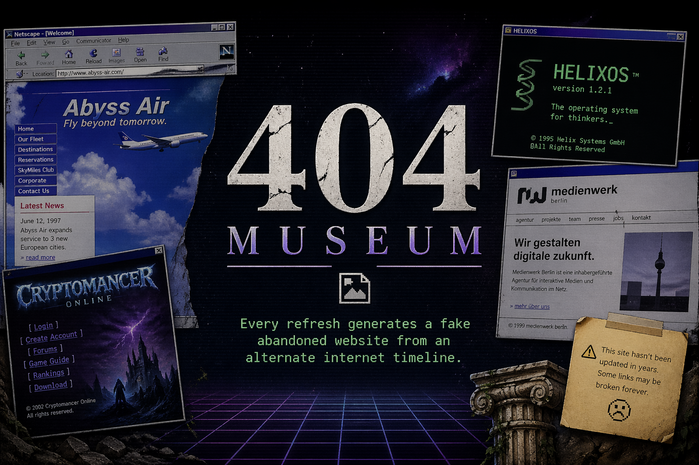

# 404 Museum

<p align="center">
  
</p>

A browser-based generative artwork that creates fake abandoned websites from an alternate internet timeline. Every page refresh reveals a different forgotten website — a failed European airline from 1997, a defunct cult operating system vendor from 2001, a dead MMORPG guild fan page from 2006 — each one plausible enough to make you briefly believe it once existed.

**[View Live](https://404.cr0ss.org)** | **[Share a Seed](https://404.cr0ss.org/?seed=hello)**

## How It Works

Each generated site is derived from a deterministic **seed**. The seed drives a seeded RNG that selects an era, archetype, region, name, visual theme, content modules, and abandonment narrative. The same seed always produces the same site, making every creation shareable via URL.

Sites span five eras, each with period-appropriate styling:

| Era | Style |
|---|---|
| 1995 -- 1999 | Table layouts, beveled buttons, under-construction energy |
| 2000 -- 2006 | Portal layouts, gradients, sidebars, visitor counters |
| 2007 -- 2013 | Glossy Web 2.0, rounded corners, download badges |
| 2014 -- 2019 | Startup minimalism, hero headers, flat UI |
| Alt-Timeline | Slightly off trends, plausible but unfamiliar products |

## Getting Started

```bash
# Install dependencies
npm install

# Start the dev server
npm run dev
```

Open `http://localhost:5173` in your browser.

## Scripts

| Command | Description |
|---|---|
| `npm run dev` | Start Vite dev server |
| `npm run build` | TypeScript compilation + Vite build |
| `npm run preview` | Serve the production build locally |
| `npm run lint` | Lint with ESLint |
| `npm run typecheck` | Type-check without emitting |
| `npm run test` | Run unit tests (Vitest) |
| `npm run test:e2e` | Run end-to-end tests (Playwright) |

## Project Structure

```
src/
  domain/        # Types, seed utilities, generators, curated datasets
    generators/  # Name, metadata, and abandonment generators
    data/        # Eras, archetypes, regions, fragment pools
    themes/      # Era-specific theme definitions
  render/        # DOM rendering — header, hero, footer, content modules
    modules/     # Reusable content sections (news, pricing, testimonials, etc.)
  ui/            # Floating controls — info, refresh, share buttons
  styles/        # CSS reset, shell layout, era themes, responsive rules
```

## Tech Stack

- **TypeScript** + **Vite** -- fast builds, no framework overhead
- **Vanilla DOM** -- lightweight rendering, no React
- **Vitest** -- unit & snapshot tests
- **Playwright** -- end-to-end browser tests
- **Vercel** -- static deployment

## Deployment

The site deploys as a static build on Vercel. See [DEPLOY.md](DEPLOY.md) for setup details.

```bash
npm run build   # outputs to dist/
```

No backend, no database, no paid APIs.

## Sharing

Click the share button (bottom-right) to copy a seeded URL. The recipient sees the exact same generated site:

```
https://404.cr0ss.org/?seed=abc123
```

## Contributing

Source code is available at [github.com/kayoslab/404-Museum](https://github.com/kayoslab/404-Museum).

## License

All rights reserved.
